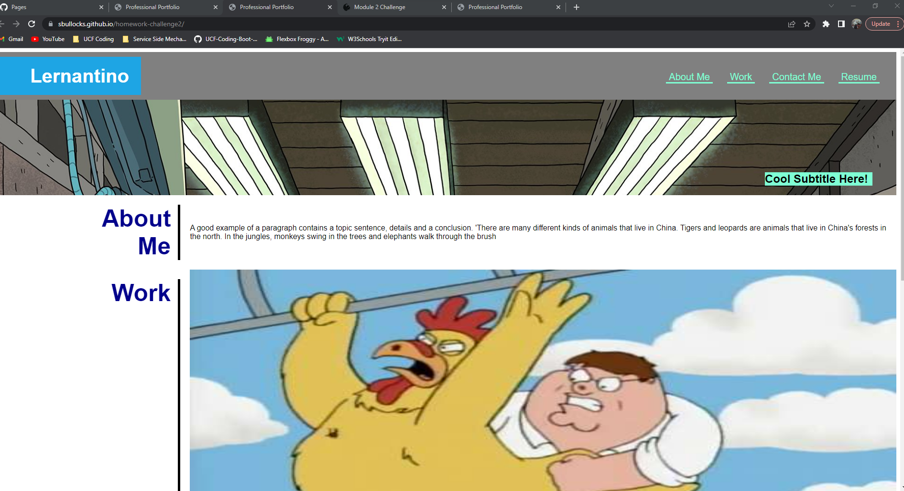

# Portfolio

This is my portfolio. I am learning HTML, CSS, GitHub, and JavaScript.

* This will be used throughout my coding future.
* I will continue to update this throughout my career. 
* Am I learn more, I will revise this project. 

## Navigation Bar

This area has links to areas throughout the home page. The links are hyperlinked allowing you to click them for faster navigation. Instead of scrolling, you can click the link to the section you want to navigate to.

## Table of Contents 

* [Navigation Bar](#navigation-bar)

* [License](#license)

* [Contributing](#contributing)

* [Link](#link)
   
* [Screenshot](#screenshot)

* [Questions](#questions)

## License

This project is licensed under the MIT license.

  
## Contributing

My coding class, [MDN](https://developer.mozilla.org/en-US/), [W3 Schools](https://www.w3schools.com/)..

## Link
Click [here](https://sbullocks.github.io/homework-challenge2/) to access the live website.

## Screenshot

## Questions

If you have any questions about the repo, contact me directly at sbullocks@gmail.com. You can find more of my work at [sbullocks](https://github.com/sbullocks).

